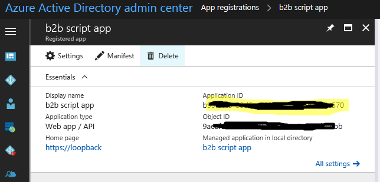

# Script for pulling AAD B2B users into on-premises Active Directory
Script sample for pulling AAD b2b users into on-premises AD
## Pre-requisites
### Create new AAD Application registration
* Log into the [Azure AD Management Portal: App Registrations](https://aad.portal.azure.com/#blade/Microsoft_AAD_IAM/ApplicationsListBlade) and Click "+ New application registration" and enter the name of your app

  

* Select "Web app / API", and enter the Sign-on URL. If you're setting this up before you deploy the app to Azure, you can enter https://loopback as a placeholder. Click "Create".

  

* From the application list, find the app you just created and click to open and edit it
* Click on "Required permissions", then click "+ Add". On "Select an API", click and select "Microsoft Graph"
* Click "Select permissions". On the "Enable Access" panel that appears, check the following items:
  * APPLICATION PERMISSIONS
    * Read Directory Data
* Click "Select"

  

* Back on the "Required permissions" panel, click the "Grant Permissions" button at the top.

  

* Back on the Settings panel, click "Keys". Under Description, enter a name for the application key, like "Key 1". Under Expires, select 1 or 2 years. (NOTE: you or someone in your organization will need to make a note to come back and refresh this key before it expires.)
* Click "Save". An application secret will be generated and displayed. COPY this key and record it - you'll need it in an minute when setting up the web application. 
>[!NOTE]
>This key will not be displayed again and cannot be retrieved. If you lose it, you'll have to come back, delete it, and create another one.

   

* Finally, before we are done with the first app, record the "Application ID". You can click to the right of it in the main panel and it will copy it to your clipboard. Record it along with the app secret from above - these two strings will be needed to setup the web app.

   

### Install required Powershell modules

Script uses two Powershell Modules:
* Active Directory 
```powershell
Install-WindowsFeature -Name RSAT-AD-PowerShell
```
* Azure Active Directory v2 Preview:
```powershell
install-module azureadpreview `
-Force `
-MinimumVersion 2.0.0.127 `
-SkipPublisherCheck
```
>[!NOTE]
>Above command requires Windows Server 2016 or [Windows Management Framework 5.0](https://www.microsoft.com/en-us/download/details.aspx?id=50395)

### Create Azure AD Group for guests that should be pulled into on-premises
To prevent pulling all users into on-premises environment, sample script filters guest users by group membership. You can identify group with PowerShell:
```powershell
Get-AzureADGroup
```
You can verify group membership by using this cmdlet:
```powershell
Get-AzureADGroupMember -ObjectId <someObjectID>
```

### Optional - Service account for running script schaduled task
We recommend using Group Managed Service Accounts.
```powershell
#running this command requires Domain Administrator Credentials
$cpu = Get-ADComputer ComputerName #Server that will be running the script
$acctName = "gmsa_b2b_script"
New-ADServiceAccount -Description "Account for creating B2B users" `
-DisplayName $acctName `
-DNSHostName "$acctName.contoso.com" `
-Name $acctName `
-PrincipalsAllowedToRetrieveManagedPassword $cpu

install-adserviceaccount $acctName
```

### Optional - register scheduled task
Task for running script on a schedule
```powershell
$action = New-ScheduledTaskAction -Execute powershell.exe `
-Argument "-NonInteractive -NoLogo -NoProfile -File c:\scripts\AppProxy-GuestShadowAccountCreation-v1.0.2.ps1"
$trigger = New-ScheduledTaskTrigger -At 7:00 -Daily
$principal = New-ScheduledTaskPrincipal -UserId corp\gmsa_b2b_script$ -LogonType Password
Register-ScheduledTask ShadowB2BUsers `
-Principal $principal `
-Action $action `
-Trigger $trigger
```

>[!IMPORTANT]
>Script requires editing. Run it manually before running the scheduled task

### Optional Delegate permissions to target OU for GMSA
Account running script requires write permissions for OU dedicated for shadow accounts
```powershell
dsacls.exe "OU=ShadowAccounts,DC=corp,DC=contoso,DC=com" /G 'corp\gmsa_b2b_script$:GA' /I:T
```

## Considerations
For increased security consider modifying script to use certificate-based authentication to impersonate Service principal in Azure AD: [Using a Service Principal to connect to a directory in PowerShell](https://docs.microsoft.com/powershell/azure/active-directory/signing-in-service-principal)